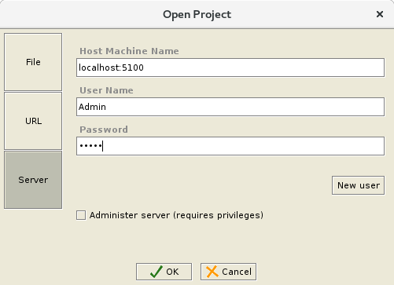
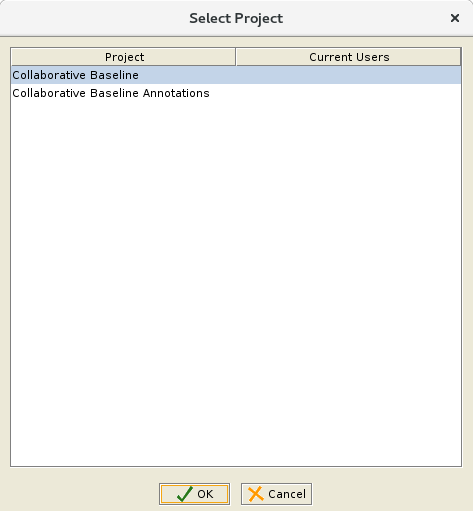

# Essential-project-docker

Unofficial Docker for https://enterprise-architecture.org

This is an example how to run EAS inside docker in server mode

**This project is not production ready!!!**

**PR are welcome**

## TL;DR
```
docker build -t local/eam .
docker run -d -p 8080:8080 --rm  -p5200:5200 -p5100:5100 -h eam local/eam
```


## Prerequisite
- Latest docker
- Protege 3.5 EAM Client see https://enterprise-architecture.org/documentation/doc-installation/65-multiuser-install-guide (Section *Client Installation* )


## Steps

### Build

```
docker build -t local/eam .
```

### Run
```
docker run -d -p 8080:8080 --rm  -p5200:5200 -p5100:5100 -h eam local/eam
````

#### Volume Mounts

The server metaproject files can also be volume mounted to host for persistance
https://docs.docker.com/storage/volumes/#start-a-container-with-a-volume
```
docker run -d -p 8080:8080 --rm  -p5200:5200 -p5100:5100 -v <host>:/opt/essentialAM/server/ -h eam local/eam
````

Can also just mount the entire repo that contains both baseline.prj and server metaproject.prj files
```
docker run -d -p 8080:8080 --rm  -p5200:5200 -p5100:5100 -v <host>:/opt/essentialAM -h eam local/eam
````

Host dir structure should be
````
HostDir (e.g./root/Essential\ Architect\ Manager/)
|
- annotation_essential_baseline_v62.pprj
- annotation_essential_baseline_v62.rdf
- annotation_essential_baseline_v62.rdfs
- essential_baseline_v62.pins
- essential_baseline_v62.pont
- essential_baseline_v62.pprj
- essential_import_utility_181.war (created during essential install)
- essential_viewer_62.war (created during essential install)
- essentialInstallInfo.html (created during essential install)
- importUtilityUpdate.txt  (created during essential install)
- protege.properties (created during essential install)
- progegePropsUpdate.txt (created during essential install)
- releaseNotes.txt (created during essential install)
- viewerUpdate.txt (created during essential install)
- widgetUpdate.txt (created during essential install)
\_install (dir created during essential install)
\_UnInstaller (dir created during essential install)
\_server
  |
  - metaproject.pprj
  - metaproject.pins
  - metaproject.pont
````

### Connect

#### Viewer (server)
- http://localhost:8080/essential_viewer (no login needed)
- http://localhost:8080/essential_import_utility
  - Username: admin@admin.com
  - Password: admin

#### Protege Client (local)

- Run Protege Client
  - <install dir>/Protege_3.5/run_protege.sh

- Open Other... -> Server
  - Host Maschine Name: locahost:5100
  - Username: Admin
  - Password : 12345
  - 
  - open the Collaborative Baseline project
  - 


